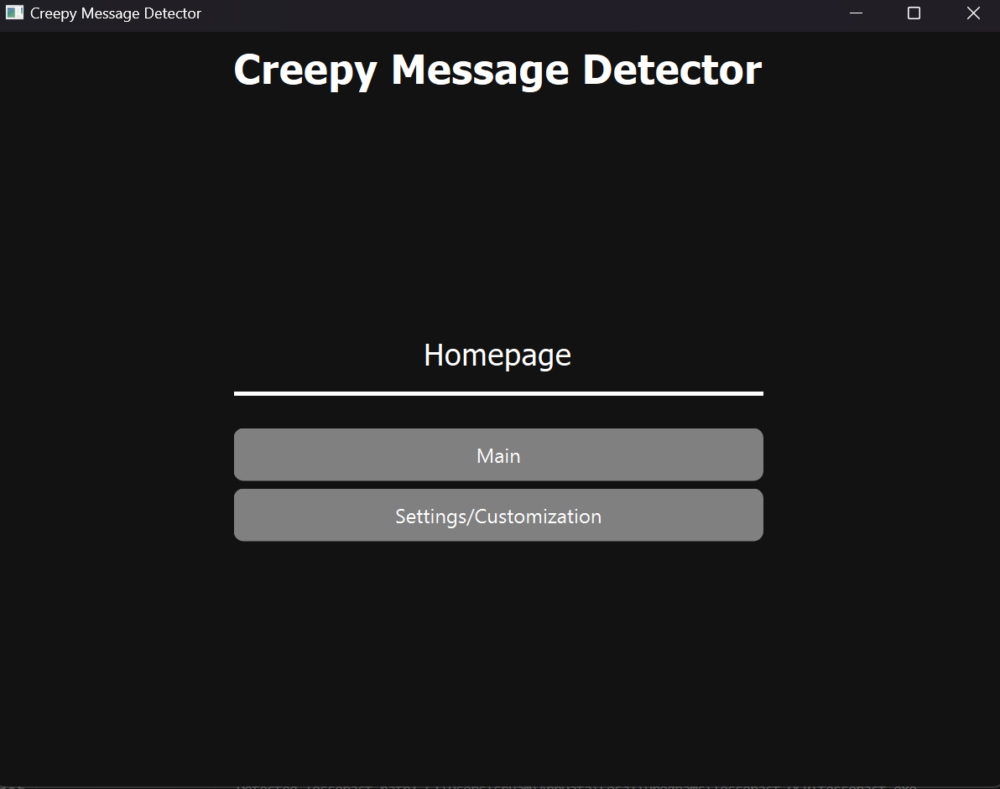
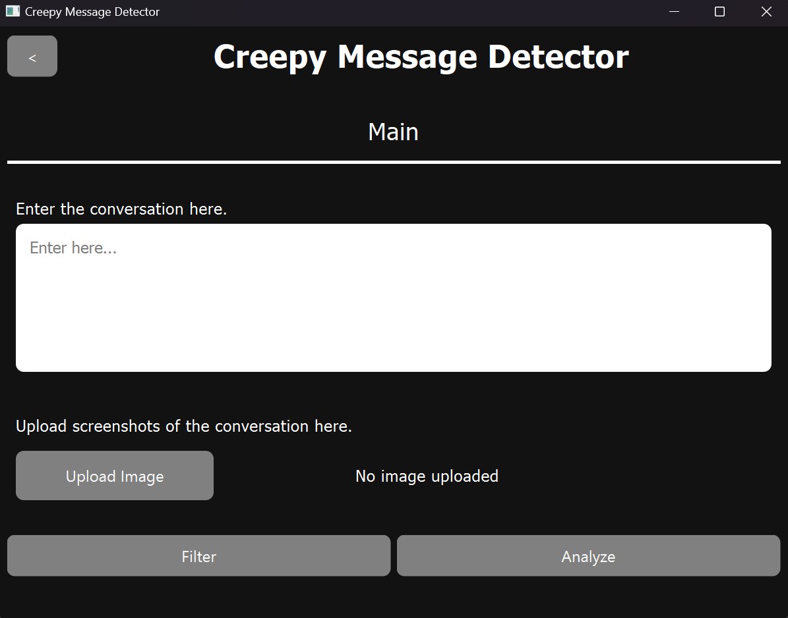
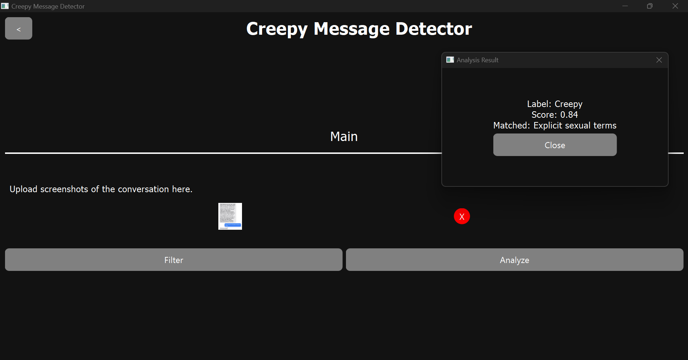

# Creepy Message Detector (PyQt6 + OCR)

A desktop app to **detect creepy or harassing messages** in text or screenshots.  
Built with **PyQt6** for the GUI and **Tesseract OCR** for extracting text from images.  
Designed to be **lightweight, explainable, and offline** (no cloud/ML dependency).

---

# creepdetectorNLP


Rule-based desktop application for detecting “creepy” or unsafe messages using NLP preprocessing + regex scoring.  
Built with **PyQt6** GUI, **pytesseract** OCR, and lightweight rule weights.

---

## Demo






<!-- Optional -->
<!--  -->

---

## Features

- **Input options**
  - Paste or type text
  - Upload a screenshot → OCR → analyze
- **Scoring system** with transparent phrase matches (e.g., `ask_send_pic`, `explicit_terms`)
- **Filter levels**
  - **Easy** (strict, ≥ 0.55)
  - **Medium** (lenient, ≥ 0.30)
- **Categories covered**
  - Requests for pics/nudes  
  - Sexual/explicit vocabulary  
  - Coercion & persistence (“don’t ignore me”)  
  - Flirt openers  
  - Harassment (slurs, insults, threats, doxxing, stalking)  
- **Conversation tracking** – recent scores are accumulated in `AppState`  
- **Runs fully offline** once Tesseract is installed  
- Text or image input (OCR via Tesseract).
- Rule‑based “creepy” scoring with intensity filter (Easy=0.55, Medium=0.30).
- Non‑blocking UI (QThread workers) with analyzing spinner + results dialog.
- Customizable background color (persisted with QSettings).
- Windows‑first setup with auto Tesseract path detection (fallback manual path).

---

## Quickstart

```bash
# 1) Clone & enter
git clone https://github.com/sp2023lab/creepdetectorNLP.git
cd creepdetectorNLP

# 2) Create venv
python -m venv venv
# Windows
venv\Scripts\activate
# macOS/Linux
# source venv/bin/activate

# 3) Install deps
pip install -r requirements.txt

# 4) (Windows) Install Tesseract OCR:
#   https://github.com/UB-Mannheim/tesseract/wiki

# 5) Run
python main.py
```

---

## How it works (tl;dr)
- Normalize text (unicode fold, leetspeak cleanup), then run regex rules.
- Each rule contributes a weight; total score ∈ [0,1].
- Intensity filter gates results: Easy≥0.55, Medium≥0.30.
- OCR runs in a worker thread; UI stays responsive.

---

## 📦 Requirements

- **Python 3.11+**
- **Tesseract OCR** (for screenshots, optional if you only analyze text)  
  - Windows typical paths:  
    - `C:\Users\<you>\AppData\Local\Programs\Tesseract-OCR\tesseract.exe`  
    - `C:\Program Files\Tesseract-OCR\tesseract.exe`
- Python packages:
  - `PyQt6`
  - `pytesseract`
  - `Pillow`

---

## Troubleshooting
**pytesseract not found**  
Activate your venv and run:
```bash
pip install pytesseract Pillow
```

---